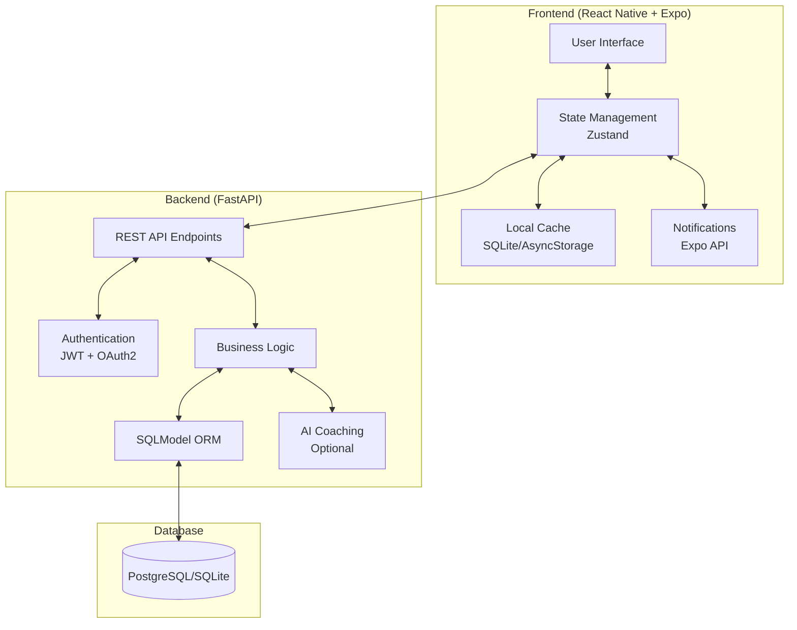
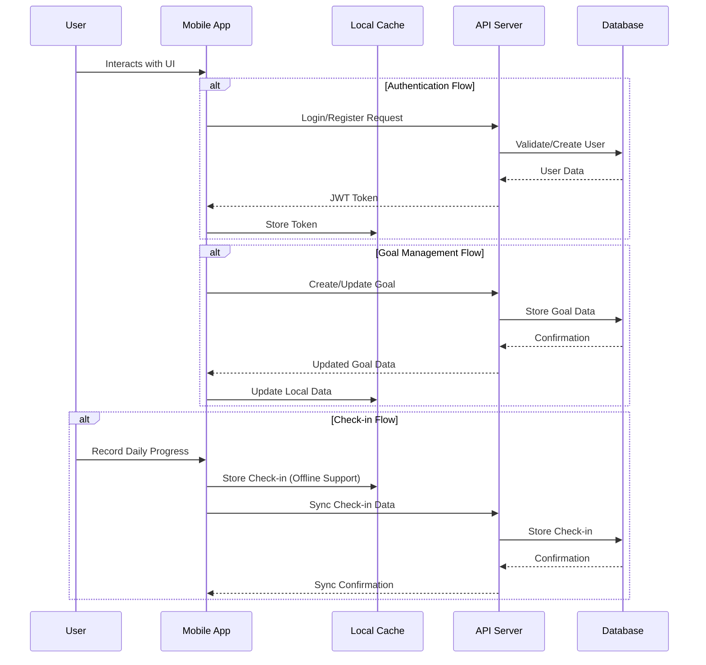
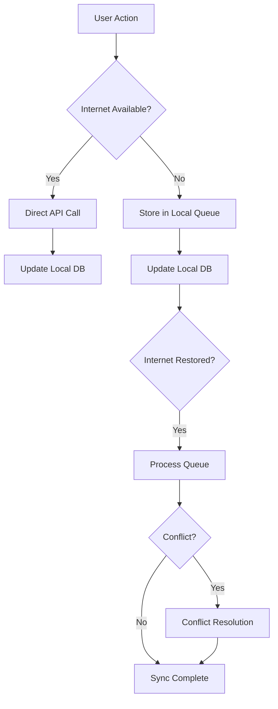

# 📋 Track My Goals - Architecture and Implementation Plan

## 1. Project Overview and Architecture

### 1.1 System Architecture

The "Track My Goals" application follows a client-server architecture with the following components:



### 1.2 Data Flow



## 2. Directory Structure and File Organization

### 2.1 Project Root Structure

```
track_my_goals/
├── backend/             # FastAPI backend
├── mobile/              # React Native + Expo mobile app
├── docs/                # Documentation
├── .gitignore
├── README.md
└── docker-compose.yml   # For local development
```

### 2.2 Backend Structure

```
backend/
├── app/
│   ├── __init__.py
│   ├── main.py          # FastAPI application entry point
│   ├── config.py        # Configuration settings
│   ├── dependencies.py  # Dependency injection
│   ├── models/          # SQLModel data models
│   │   ├── __init__.py
│   │   ├── user.py
│   │   ├── goal.py
│   │   └── checkin.py
│   ├── schemas/         # Pydantic schemas for request/response
│   │   ├── __init__.py
│   │   ├── user.py
│   │   ├── goal.py
│   │   └── checkin.py
│   ├── api/             # API endpoints
│   │   ├── __init__.py
│   │   ├── deps.py      # API specific dependencies
│   │   ├── auth.py      # Authentication endpoints
│   │   ├── goals.py     # Goal management endpoints
│   │   └── checkins.py  # Check-in endpoints
│   ├── core/            # Core functionality
│   │   ├── __init__.py
│   │   ├── security.py  # JWT, password hashing
│   │   └── config.py    # Core configuration
│   ├── db/              # Database
│   │   ├── __init__.py
│   │   ├── session.py   # DB session management
│   │   └── init_db.py   # DB initialization
│   └── services/        # Business logic
│       ├── __init__.py
│       ├── user.py
│       ├── goal.py
│       └── checkin.py
├── tests/               # Unit and integration tests
│   ├── __init__.py
│   ├── conftest.py
│   ├── test_auth.py
│   ├── test_goals.py
│   └── test_checkins.py
├── alembic/             # Database migrations
│   ├── versions/
│   ├── env.py
│   └── alembic.ini
├── pyproject.toml       # Dependencies and project metadata
├── .env.example         # Example environment variables
├── Dockerfile           # For containerization
└── README.md            # Backend documentation
```

### 2.3 Mobile App Structure

```
mobile/
├── App.js               # Entry point
├── app.json             # Expo configuration
├── babel.config.js      # Babel configuration
├── tailwind.config.js   # NativeWind configuration
├── src/
│   ├── api/             # API client
│   │   ├── index.js     # API setup (axios)
│   │   ├── auth.js      # Auth API calls
│   │   ├── goals.js     # Goal API calls
│   │   └── checkins.js  # Check-in API calls
│   ├── components/      # Reusable UI components
│   │   ├── Button.js
│   │   ├── GoalCard.js
│   │   ├── CheckInForm.js
│   │   └── ...
│   ├── screens/         # App screens
│   │   ├── auth/
│   │   │   ├── LoginScreen.js
│   │   │   └── RegisterScreen.js
│   │   ├── goals/
│   │   │   ├── GoalsListScreen.js
│   │   │   ├── GoalDetailScreen.js
│   │   │   └── CreateGoalScreen.js
│   │   ├── checkins/
│   │   │   ├── CheckInScreen.js
│   │   │   └── CheckInHistoryScreen.js
│   │   └── ...
│   ├── navigation/      # React Navigation setup
│   │   ├── index.js
│   │   ├── AuthNavigator.js
│   │   └── MainNavigator.js
│   ├── store/           # Zustand state management
│   │   ├── authStore.js
│   │   ├── goalStore.js
│   │   └── checkinStore.js
│   ├── utils/           # Utility functions
│   │   ├── dateUtils.js
│   │   ├── storageUtils.js
│   │   └── validationUtils.js
│   ├── hooks/           # Custom React hooks
│   │   ├── useAuth.js
│   │   ├── useGoals.js
│   │   └── useCheckins.js
│   └── constants/       # App constants
│       ├── colors.js
│       ├── layout.js
│       └── api.js
├── assets/              # Images, fonts, etc.
├── .gitignore
├── package.json
└── README.md            # Mobile app documentation
```

## 3. Detailed Implementation Roadmap

Based on your preference to focus on core functionality first and work as a solo developer, here's a realistic implementation roadmap:

### Phase 1: Project Setup and Core Backend (Weeks 1-3)

#### Week 1: Project Initialization
- Set up project repositories and directory structure
- Configure development environment
- Set up FastAPI backend skeleton
- Implement database models and migrations
- Create basic API structure

#### Week 2: Authentication System
- Implement user registration and login endpoints
- Set up JWT token generation and validation
- Create password hashing and security utilities
- Develop authentication middleware
- Write tests for authentication flows

#### Week 3: Goal Management Backend
- Implement goal CRUD operations
- Create user-goal relationships
- Develop goal filtering and sorting
- Write tests for goal management
- Document API endpoints

### Phase 2: Core Mobile App Development (Weeks 4-7)

#### Week 4: Mobile App Setup
- Initialize React Native with Expo
- Set up NativeWind for styling
- Configure navigation structure
- Implement API client with axios
- Create state management with Zustand

#### Week 5: Authentication UI
- Develop login screen
- Create registration screen
- Implement token storage
- Set up protected routes
- Handle authentication errors

#### Week 6: Goal Management UI
- Create goal list screen
- Develop goal detail view
- Implement goal creation form
- Add goal editing functionality
- Design goal deletion confirmation

#### Week 7: Check-in System
- Implement backend check-in endpoints
- Create check-in UI components
- Develop daily check-in screen
- Add check-in history view
- Write tests for check-in functionality

### Phase 3: Data Synchronization and Offline Support (Weeks 8-10)

#### Week 8: Local Storage
- Implement SQLite schema for local data
- Create data synchronization logic
- Handle offline check-ins
- Develop conflict resolution strategy
- Test offline to online transitions

#### Week 9: Progress Visualization
- Implement backend summary endpoints
- Create streak calculation logic
- Develop chart components
- Add calendar view for check-ins
- Design progress dashboard

#### Week 10: Notifications
- Set up local notification system
- Implement reminder scheduling
- Create notification preferences
- Add notification handling
- Test notification delivery

### Phase 4: Refinement and Optional Features (Weeks 11-12)

#### Week 11: Testing and Refinement
- Conduct end-to-end testing
- Optimize performance
- Improve error handling
- Enhance UI/UX
- Fix bugs and issues

#### Week 12: Deployment Preparation
- Prepare backend for deployment
- Configure Docker for production
- Set up CI/CD pipeline
- Prepare mobile app for stores
- Create deployment documentation

### Future Phases (Post-MVP)

#### AI Coaching Integration
- Research AI integration options
- Implement backend AI service
- Create coaching message templates
- Develop weekly summary generation
- Add AI feedback UI

#### Advanced Features
- Social features (accountability partners)
- Custom goal types and tagging
- Voice-based journaling
- Wearable integration

## 4. Technical Challenges and Solutions

### 4.1 Offline Functionality and Data Synchronization

**Challenge:** Ensuring seamless operation when the app is offline and proper synchronization when connectivity is restored.

**Solution:**
- Implement a local SQLite database to store user data offline
- Use a queue system for pending API operations
- Develop a synchronization algorithm that handles conflicts
- Implement optimistic UI updates with rollback capability
- Use timestamps to determine the most recent data version



### 4.2 Authentication and Security

**Challenge:** Implementing secure authentication while maintaining a good user experience.

**Solution:**
- Use JWT with short expiration times
- Implement refresh token rotation
- Store tokens securely using secure storage
- Add token validation middleware on all protected routes
- Implement proper error handling for authentication failures

### 4.3 Type-Safe API Communication

**Challenge:** Ensuring type safety between frontend and backend.

**Solution:**
- Use Pydantic schemas in the backend
- Generate TypeScript interfaces from Pydantic models
- Implement strong typing in API client functions
- Use Zod or similar for runtime validation in the frontend
- Create shared validation logic where possible

### 4.4 Performance Optimization

**Challenge:** Ensuring the app remains responsive with growing data.

**Solution:**
- Implement pagination for list endpoints
- Use virtualized lists in the frontend
- Optimize database queries with proper indexing
- Implement caching strategies for frequently accessed data
- Use lazy loading for non-critical components

## 5. Technology Recommendations

### 5.1 Backend Recommendations

| Component | Recommendation | Rationale |
|-----------|---------------|-----------|
| Database | SQLite for development, PostgreSQL for production | SQLite is simpler for local development, while PostgreSQL offers better scalability and concurrency for production |
| Token Management | PyJWT | Simpler API compared to python-jose, with good community support |
| API Documentation | FastAPI's built-in Swagger UI + ReDoc | Automatic documentation generation from code |
| Testing | pytest + pytest-asyncio | Excellent support for testing async code in FastAPI |
| Dependency Management | Poetry | Better dependency resolution than pip, with lock file support |
| Linting & Formatting | Black + isort + flake8 | Industry standard tools for Python code quality |

### 5.2 Frontend Recommendations

| Component | Recommendation | Rationale |
|-----------|---------------|-----------|
| Form Management | React Hook Form | Lightweight and performant form validation |
| Charts | Victory Native | Well-maintained charting library with React Native support |
| Date Handling | date-fns | Lightweight alternative to moment.js |
| Local Database | WatermelonDB | Better performance than plain SQLite for complex queries |
| Type Checking | TypeScript | Catch errors early and improve code quality |
| Testing | Jest + React Native Testing Library | Industry standard for React Native testing |
| State Persistence | zustand-persist | Simple persistence layer for Zustand stores |

### 5.3 Development Workflow

| Tool | Recommendation | Rationale |
|------|---------------|-----------|
| Version Control | Git + GitHub | Industry standard with good CI/CD integration |
| CI/CD | GitHub Actions | Free for public repositories, good integration with GitHub |
| Code Quality | SonarQube or CodeClimate | Automated code quality checks |
| API Testing | Postman or Insomnia | Manual API testing and documentation |
| Documentation | Markdown + MkDocs | Simple, developer-friendly documentation |